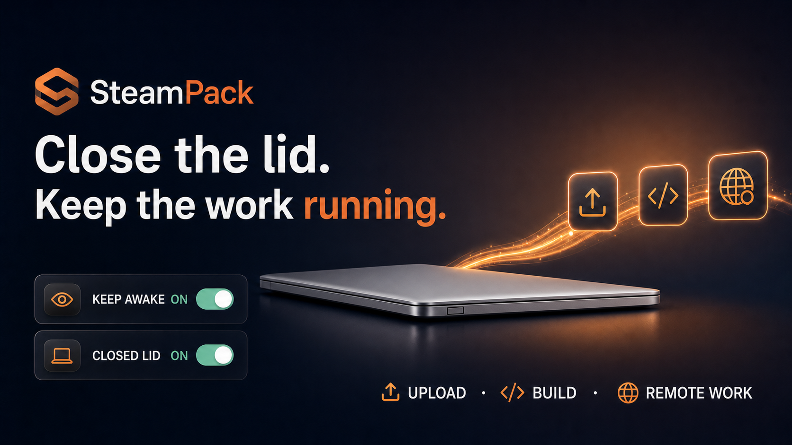

<div align="right">

[](README_ko.md)

</div>

<div align="center">



# SteamPack

**Close the lid without stopping an upload, build, or remote session.**

[](LICENSE)
[](https://www.apple.com/macos/)
[](README_ko.md)

[Build from source](#install-from-source) · [Releases](https://github.com/Hahyun-Lee/steampack-fork/releases)

</div>

SteamPack is a macOS menu bar app with two controls: **Keep Awake** and **Closed Lid**. Use them from the app, Control Center, or the menu bar.

## Choose a mode

| Mode | What it does | Permission |
|---|---|---|
| **Keep Awake** | Prevents idle, display, and disk sleep while the lid is open | None |
| **Closed Lid** | Keeps the Mac running after the lid closes, including on battery | One administrator approval |

**Closed Lid** also turns on **Keep Awake**. Turning **Keep Awake** off restores normal sleep behavior.

Closed Lid turns itself off at 20% battery, under serious thermal pressure, or if SteamPack stops unexpectedly.

> There is no DMG in this preview. Build from source using your own Apple Development team. Public binaries will be added after Developer ID signing and Apple notarization are available.

## Install from source

Requirements: macOS Tahoe 26+, Xcode 26, [Homebrew](https://brew.sh), XcodeGen, and an Apple Development team. A free Apple ID team works.

```bash
git clone https://github.com/Hahyun-Lee/steampack-fork.git
cd steampack-fork
brew install xcodegen
DEVELOPMENT_TEAM=YOUR_10_CHARACTER_TEAM_ID scripts/build.sh
ditto build/SteamPack.app /Applications/SteamPack.app
open /Applications/SteamPack.app
```

To build in Xcode, run `xcodegen generate`, open `SteamPack.xcodeproj`, and select your team for both app targets under **Signing & Capabilities**. Then run the **SteamPack** scheme.

## Use SteamPack

Open the SteamPack menu bar icon and choose the mode you need.

- For downloads, presentations, or builds with the lid open, choose **Turn Keep Awake On**.
- To close the lid, choose **Install Closed-Lid Permission…** once and approve the macOS prompt. Then choose **Keep Working with Lid Closed**.
- When finished, turn **Keep Awake** off. Both modes return to normal sleep behavior.

The Closed Lid permission allows only these two commands:

```text
/usr/bin/pmset disablesleep 1
/usr/bin/pmset disablesleep 0
```

SteamPack does not store or pass along your administrator password.

## Add the Control Center controls

1. Open macOS **Control Center** and choose **Edit Controls**.
2. Add **SteamPack Keep Awake** and **SteamPack Closed Lid**.
3. Pin either control to the menu bar if you want quicker access.

The SteamPack app must be running. When it is not, the controls show OFF and offer to open the app.

## Closed-lid safety

Keep a running MacBook on a hard, ventilated surface. Do not put it in a bag while Closed Lid is on.

SteamPack turns Closed Lid off when:

- battery reaches 20% while unplugged;
- macOS reports serious or critical thermal pressure;
- the auto-off timer expires;
- you choose **Quit & Restore Sleep**;
- the app crashes or is force-killed.

A separate watchdog restores normal lid-close sleep if the app stops unexpectedly. Each session has its own token, so an old watchdog cannot stop a newer session. SteamPack also refuses to take over a `SleepDisabled` state created by another tool.

Control Center reports the state that macOS actually applied. If the app heartbeat disappears, the controls return to OFF.

## Uninstall

1. Choose **Remove Closed-Lid Permission…** in the SteamPack menu.
2. Choose **Quit & Restore Sleep**.
3. Move `SteamPack.app` from Applications to the Trash.

## Language

SteamPack follows the macOS language setting. To set a language only for SteamPack, open **System Settings → General → Language & Region → Applications**, add SteamPack, and choose English or Korean.

## Troubleshooting

| Problem | What to check |
|---|---|
| Controls are missing | Confirm macOS 26+, launch SteamPack once, then reopen **Edit Controls**. |
| A control asks to open SteamPack | Launch `/Applications/SteamPack.app`. |
| Closed Lid will not turn on | Install the Closed Lid permission from the app menu. |
| Closed Lid is unavailable | Another app or command owns the global `SleepDisabled` state. Restore that tool first. |
| Korean UI does not appear | Select Korean for SteamPack in **Language & Region → Applications**, then relaunch. |

## Tests

```bash
xcodegen generate
xcodebuild \
  -project SteamPack.xcodeproj \
  -scheme SteamPack \
  -derivedDataPath /tmp/steampack-tests \
  CODE_SIGNING_ALLOWED=NO \
  test
```

After building and installing the Closed Lid permission, run `scripts/verify-crash-recovery.sh` to test watchdog recovery. The script refuses to run if sleep is already disabled.

`scripts/release.sh` will not create a public binary unless signature verification, notarization, stapling, and Gatekeeper assessment all pass.

## Limitations

- `pmset disablesleep` is undocumented macOS behavior and may change.
- The safety cutoffs reduce risk; they do not make it safe to run a closed MacBook in a bag.
- SteamPack cannot share ownership with another tool that changes the global `SleepDisabled` flag.

SteamPack has no telemetry, analytics, accounts, network requests, or stored passwords. See [PRIVACY.md](PRIVACY.md) and [SECURITY.md](SECURITY.md).

SteamPack is an MIT-licensed fork of [tykimos/steampack](https://github.com/tykimos/steampack). The original copyright and license are preserved.
