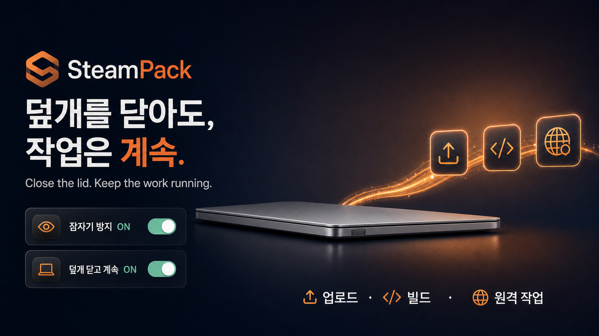

<div align="right">

[](README.md)

</div>

<div align="center">



# SteamPack — 덮개를 닫아도, 작업은 계속

**덮개를 열어둘 때와 닫을 때를 위한 간단한 macOS 컨트롤 두 개.**

[](LICENSE)
[](https://www.apple.com/macos/)
[](README.md)

</div>

SteamPack은 긴 업로드·빌드·백업·원격 작업 중 Mac이 잠들지 않게 하는 작은 오픈소스 메뉴 막대 앱입니다. 두 기능을 macOS 제어 센터나 메뉴 막대에 바로 놓고 쓸 수 있습니다.

## 어떤 기능을 켜야 할까요?

| 기능 | 하는 일 | 이럴 때 사용 | 권한 |
|---|---|---|---|
| **잠자기 방지** | 덮개를 연 동안 유휴·화면·디스크 잠자기를 막습니다 | 발표, 다운로드, 빌드 | 필요 없음 |
| **덮개 닫고 계속** | 배터리 사용 중에도 덮개를 닫은 뒤 작업을 계속합니다 | 업로드, 원격 접속, 장시간 에이전트 | 제한된 관리자 승인 1회 |

**덮개 닫고 계속**을 켜면 **잠자기 방지**도 함께 켜집니다. **잠자기 방지**를 끄면 모든 잠자기 설정이 정상으로 돌아옵니다.

> **소스 프리뷰:** Developer ID 서명과 Apple 공증이 준비되기 전까지 공개 DMG는 의도적으로 제공하지 않습니다. 현재 릴리스는 소스 빌드가 가능한 사용자를 위한 버전입니다.

## 처음부터 끝까지

### 1. 빌드하고 설치하기

macOS Tahoe 26+, Xcode 26, [Homebrew](https://brew.sh), XcodeGen, Apple Development 팀이 필요합니다. 무료 Apple ID 팀도 사용할 수 있습니다.

```bash
git clone https://github.com/Hahyun-Lee/steampack-fork.git
cd steampack-fork
brew install xcodegen
DEVELOPMENT_TEAM=10자리_팀_ID scripts/build.sh
ditto build/SteamPack.app /Applications/SteamPack.app
open /Applications/SteamPack.app
```

Xcode를 이용하려면 `xcodegen generate`를 실행하고 `SteamPack.xcodeproj`를 연 다음, **Signing & Capabilities**에서 두 앱 target에 자신의 팀을 선택하고 **SteamPack** scheme을 실행하세요.

### 2. 필요한 기능 켜기

메뉴 막대에서 SteamPack 아이콘을 누릅니다.

- 덮개를 열어둘 때는 **잠자기 방지 켜기**를 선택합니다. 관리자 권한이 필요 없습니다.
- 덮개를 닫아야 한다면 **덮개 닫기 권한 설치…**를 한 번 선택하고 macOS 승인 창을 확인한 뒤 **덮개 닫고 계속 사용**을 선택합니다.

설치되는 규칙은 아래의 정확한 명령 두 개만 허용합니다. 관리자 비밀번호를 저장하거나 명령으로 전달하지 않습니다.

```text
/usr/bin/pmset disablesleep 1
/usr/bin/pmset disablesleep 0
```

### 3. 제어 센터에 추가하기

1. macOS **제어 센터**를 엽니다.
2. **컨트롤 편집**을 선택합니다.
3. **SteamPack 잠자기 방지**와 **SteamPack 덮개 닫고 계속**을 추가합니다.
4. 원하면 두 컨트롤을 메뉴 막대에 바로 고정합니다.

SteamPack 앱은 실행 중이어야 합니다. 앱이 꺼져 있으면 컨트롤은 안전하게 OFF를 표시하고 앱을 열도록 안내합니다.

### 4. 안전하게 사용하기

필요한 기능을 켠 뒤 메뉴에 활성 상태가 표시되는지 확인하세요. MacBook은 통풍되는 단단한 바닥에 두어야 하며, 작동 중인 닫힌 MacBook을 가방에 넣으면 안 됩니다.

다음 상황에서는 **덮개 닫고 계속**이 자동으로 꺼집니다.

- 전원 연결 없이 배터리가 20%에 도달했을 때
- macOS가 심각하거나 위험한 발열 상태를 알렸을 때
- 자동 종료 타이머가 끝났을 때
- **종료하고 정상 잠자기로 복구**를 선택했을 때
- 앱이 crash 또는 강제 종료되었을 때

### 5. 끄거나 완전히 제거하기

평소에는 **잠자기 방지 끄기**만 선택하면 모든 잠자기 동작이 정상으로 돌아옵니다.

완전히 제거하려면:

1. SteamPack 메뉴에서 **덮개 닫기 권한 제거…**를 선택합니다.
2. **종료하고 정상 잠자기로 복구**를 선택합니다.
3. 응용 프로그램 폴더의 `SteamPack.app`을 휴지통으로 옮깁니다.

## 한국어·영어 UI

SteamPack은 macOS 언어 설정을 따릅니다. SteamPack에만 별도 언어를 지정하려면 **시스템 설정 → 일반 → 언어 및 지역 → 응용 프로그램**에서 SteamPack을 추가한 뒤 한국어 또는 영어를 선택하세요.

## 기본으로 켜지는 안전장치

- **강제 종료 복구:** 덮개 닫기 세션마다 별도 연결 감시 프로세스가 동작해 crash·SIGKILL 뒤에도 정상 잠자기를 복구합니다.
- **세션 소유권:** 이전 감시 프로세스가 새 세션을 끌 수 없고, 다른 도구가 만든 잠자기 상태를 SteamPack이 가로채지 않습니다.
- **실제 상태 표시:** 제어 센터는 요청값이 아니라 적용이 확인된 상태만 표시하며 앱 신호가 끊기면 OFF로 닫힙니다.
- **배터리·온도 보호:** 배터리 20%, 심각한 발열, 위험한 발열에서 정상 잠자기로 돌아갑니다.
- **최소 권한·개인정보 보호:** shell, 와일드카드 인자, 저장된 비밀번호, 텔레메트리, 계정, 네트워크 요청이 없습니다.

## 문제 해결

| 증상 | 해결 방법 |
|---|---|
| 제어 센터에 컨트롤이 없음 | macOS 26+인지 확인하고 SteamPack을 한 번 실행한 뒤 **컨트롤 편집**을 다시 엽니다. |
| 앱을 열라는 메시지가 표시됨 | `/Applications/SteamPack.app`을 실행합니다. 앱이 없으면 컨트롤은 의도적으로 OFF가 됩니다. |
| 덮개 닫기 기능이 켜지지 않음 | 앱 메뉴에서 제한된 권한을 설치한 뒤 다시 시도합니다. |
| 덮개 닫기 메뉴를 누를 수 없음 | 다른 앱이나 명령이 전역 `SleepDisabled` 상태를 사용 중입니다. 해당 도구에서 먼저 정상 상태로 복구하세요. |
| 한국어 UI가 표시되지 않음 | **언어 및 지역 → 응용 프로그램**에서 SteamPack 언어를 한국어로 지정하고 다시 실행합니다. |

## 테스트와 릴리스 무결성

```bash
xcodegen generate
xcodebuild \
  -project SteamPack.xcodeproj \
  -scheme SteamPack \
  -derivedDataPath /tmp/steampack-tests \
  CODE_SIGNING_ALLOWED=NO \
  test
```

빌드와 제한된 권한 설치 후 `scripts/verify-crash-recovery.sh`를 실행하면 `SleepDisabled`를 잠깐 켜고 crash와 같은 연결 종료를 만든 뒤 정상 잠자기 복구를 검증합니다. 이미 잠자기가 비활성화된 상태에서는 실행을 거부합니다.

`scripts/release.sh`는 Developer ID 서명과 Apple 공증 없이는 공개 파일 생성을 거부합니다. 바이너리 릴리스는 서명 검증·공증·stapling·Gatekeeper 평가를 모두 통과해야 합니다.

## 중요한 한계

- `pmset disablesleep`은 문서화되지 않은 macOS 동작이므로 향후 바뀔 수 있습니다.
- 보호 장치가 위험을 줄여도 고부하 상태의 닫힌 MacBook을 가방 안에서 안전하게 만들 수는 없습니다.
- 동일한 전역 `SleepDisabled` 값을 바꾸는 다른 도구와는 소유권을 공유할 수 없습니다.

SteamPack에는 텔레메트리, 분석, 계정, 네트워크 요청, 저장된 비밀번호가 없습니다. 자세한 내용은 [개인정보 보호](PRIVACY_ko.md)와 [보안 정책](SECURITY_ko.md)을 참고하세요.

SteamPack은 MIT 라이선스 프로젝트 [tykimos/steampack](https://github.com/tykimos/steampack)의 fork입니다. 원저작권과 라이선스를 그대로 보존합니다.
